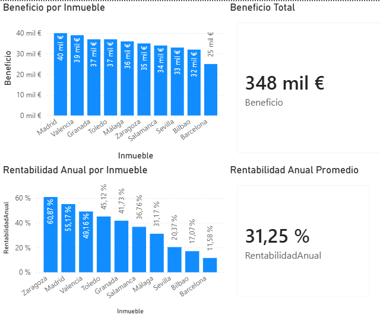

# 📊 Dashboard Inmobiliario

Análisis de inversiones inmobiliarias mediante Power BI, centrado en beneficio y rentabilidad anual.

---

## 🖼️ Vista del dashboard

---

## 🎯 Objetivo

Visualizar de forma clara la rentabilidad de distintas operaciones inmobiliarias para facilitar la toma de decisiones.

---

## 📊 Métricas analizadas

- 💰 Beneficio total por inmueble  
- 📈 Rentabilidad anual por inmueble  
- ⏱️ Impacto del tiempo de operación (meses)  

---

## ⚙️ Funcionalidades

- Selección de inmuebles directamente desde los gráficos  
- Filtrado dinámico mediante slider de meses de operación  
- Actualización automática de métricas y visualizaciones  

---

## 🧰 Herramientas utilizadas

- Power BI Desktop  

---

## 📁 Archivos incluidos

- `dashboard_inmobiliario.pbix` → archivo del dashboard  
- `datos_inmobiliarios.xlsx` → dataset utilizado  
- `dashboard.png` → captura del dashboard  

---

## 🚀 Uso

1. Abrir el archivo `.pbix` en Power BI Desktop  
2. Interactuar con los gráficos para explorar los datos  
3. Ajustar filtros para analizar distintos escenarios  

---

## 👩‍💻 Autor

Beatriz Esteban – Estudiante de ASIR
